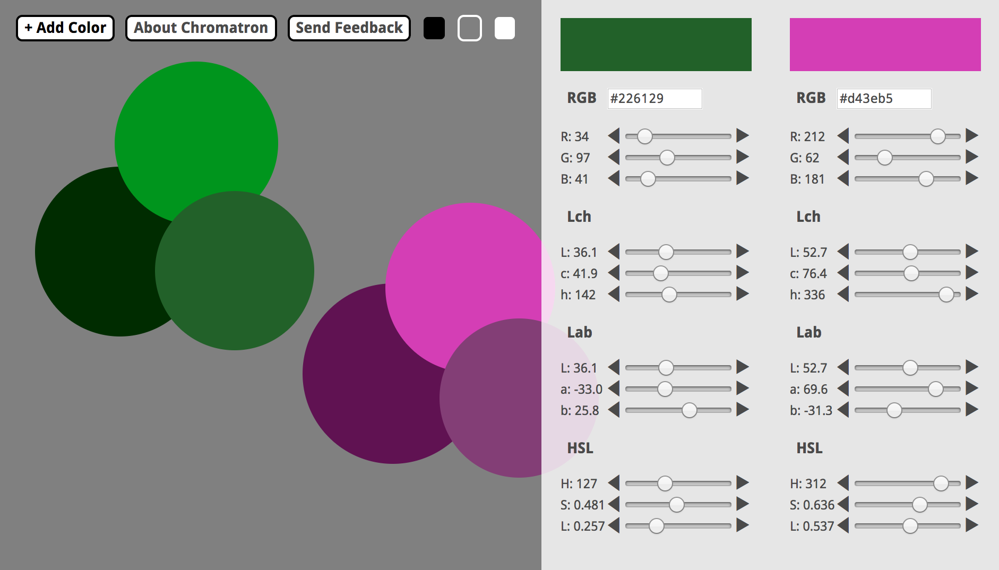

Chromatron
==========

Pick and share color palettes with Chromatron. Add, move, and resize blobs
of color. Change them using a variety of color spaces.

→︎ [Try it live](http://chromatron.s3-website-us-east-1.amazonaws.com/#eNpl0MEKwjAMBuB3idce0mRpu76KeHDrlOFwMBGUsXd3XcsqSq7/x59khnYcxukB/jhDH8BbVHDphwE8HBxzZw0oeIGvXK3gDZ6tUTCtOVlUFlREqLhrJIuKN0ExsAqHu+AiEGvRIQntZBOac4fdRfUtqEXMQucOdr8dUgSR0VQnQaSTkL87bBEGNQklwfEl8XLh1CHLSUFzbm/XaXzew/YpjLPm+3vo4l6EywftDlYm)

_This project was bootstrapped with [Create React App](https://github.com/facebookincubator/create-react-app)._
